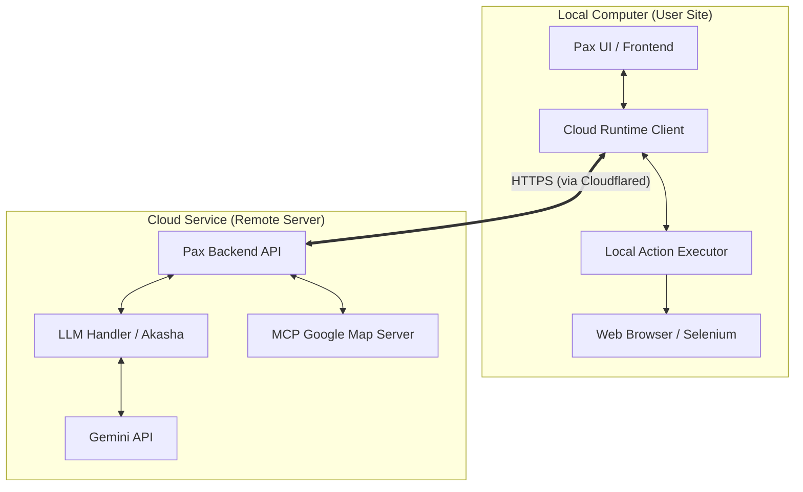

# Pax 雲端架構遷移計畫 (CLOUD_ARCHITECTURE_PLAN)

## 0. 背景與目標
目前 Pax 已經完成本地端 (Local) 的設置與執行。為了提升處理效能、保護敏感 API Key 並簡化使用者環境要求，我們將實作 **「雲端後端 + 本地前端」** 的並存架構。

- **客戶端 (Local Client)**: 負責 UI、取得認證 (Cookies)、以及執行本地 Action。
- **雲端伺服器 (Cloud API Server)**: 負責 LLM 邏輯、Google Maps 查詢，並透過 `cloudflared` 隧道作為入口點。
- **並存與建置機制**: 
    - 統一產出目錄為 **`dist/`**。
    - `scripts/build_portable.py`: 產出完整功能本地版於 `dist/portable/`。
    - `scripts/build_cloud_service.py`: 產出雲端版於 `dist/cloud/`（含 client 與 server）。

---

## 1. 系統架構圖 (Hybrid Architecture)



---

## 2. 元件職責拆解

### A. 雲端後端 (Cloud Server)
- **佈署方式**: 直接運行於具備 Python 3.10+ 環境的伺服器。
- **入口服務**: 使用 `cloudflared` 隧道映射本地 8000 端口至公網網址。
- **服務內容**: 
    - `runtime/cloud/server/main.py` (FastAPI 服務)。
    - `tools/mcp-google-map` (Node.js MCP 伺服器)。
- **安全認證**: 實作簡單的 `X-API-KEY` Header 驗證機制。

### B. 本地客戶端 (Local Client)
- **環境規格**: 內建極簡版嵌入式 Python (移除大型 AI 模型庫，如 torch/transformers)，體積大幅縮減。
- **認證管理**: 僅在本地端處理並儲存使用者的 Cookies/Session，不隨意上傳雲端，僅在執行 Action 時由本地傳遞給瀏覽器。
- **指令執行**: 接收雲端生成的操作指令 (Action JSON)，開啟本地瀏覽器完成任務。

---

## 3. 認證機制 (Simple Security)
採用 **自動化脫敏認證機制**：
1.  **環境設定**: 統一在根目錄 `.env` 設定，建置腳本會自動進行以下處理：
    - **Server 端**: 移除使用者 Session (如 `CLIENT_TICKET`)，僅保留 API Key。實現「清淨大腦」模式。
    - **Client 端**: 移除 API Key (如 `GEMINI_API_KEY`)，僅保留使用者 Session。防止 Key 外流。
2.  **格式規範**: `.env` 中的數值**不使用單引號或雙引號**，確保跨平台解析穩定性。
3.  **通訊安全**: 所有 API 請求必須攜帶 `X-API-KEY` 標頭，並全程透過 HTTPS 傳輸。

---

## 4. 雙重建置腳本規劃

### 1. `python scripts/build_portable.py` (本地全功能版)
*   **輸出路徑**: `dist/portable/`
*   **特性**: 包含完整 `akasha` 與 MCP 執行環境，支援完全離線運作，適合隱私敏感或無網環境。

### 2. `python scripts/build_cloud_service.py` (雲端並存版)
此腳本會產生兩個輸出資料夾：
*   **`dist/cloud/server/`**: 
    *   **特性**: 僅包含程式原始碼、MCP 工具與 `requirements.txt`。
    *   **安全**: 自動過濾個人 Session 憑證，僅保留 API Key。
    *   **環境**: 由伺服器管理員自行配置 Python 環境。
*   **`dist/cloud/client/`**: 
    *   **特性**: 使用瘦身後的嵌入式 Python（約 100MB），移除大型 AI 庫。
    *   **安全**: 自動移除 `GEMINI_API_KEY` 等敏感金鑰，僅保留執行用憑證。
    *   **產出**: **`PaxClient.bat`**。

---

## 6. 後端 API 功能規劃 (Backend API Design)

為了實現雲端「大腦」與本地「手腳」的協作，後端伺服器需要提供以下 API：

### A. 全域認證 (Security)
所有 API 必須在 Header 攜帶驗證資訊：
- **Header**: `X-API-KEY: <PAX_CLOUD_API_KEY>`

---

### B. 核心功能端點 (Core Endpoints)

#### 1. 狀態檢查 (Health Check)
- **Endpoint**: `GET /`
- **功能**: 確認伺服器是否正常運作，並回傳當前伺服器版本。
- **回應**: `{"status": "ok", "version": "1.0.0", "mode": "cloud_server"}`

#### 2. 智慧對話與指令生成 (Chat & Action Generation)
- **Endpoint**: `POST /api/chat`
- **功能**: 接收使用者訊息，伺服器端會調用 `akasha` 代理人。`akasha` 會自行判斷是否需要調用雲端的 MCP 工具（如 Google Maps），最終回傳結構化的 Action 指令給客戶端。
- **內部流程**: 
    1. 接收訊息。
    2. 調用 LLM + 雲端 MCP 服務（由伺服器內部透過 stdio/http 連接）。
    3. 解析 LLM 回應。
    4. 回傳 Action 指令。
- **請求格式**:
  ```json
  {
    "message": "幫我查去台北的里程並報帳",
    "cookies": {
      "ASP_NET_SESSION_ID": "...",
      "CLIENT_TICKET": "..."
    },
    "context": {
      "history": [],
      "local_time": "2026-01-17T21:30:00"
    }
  }
  ```
- **回應格式 (Structured JSON)**:
  伺服器現在回傳完整的結構化回應，不再使用字串標籤解析：
  ```json
  {
    "response": "根據 Google Maps 查詢，從台中到台北的里程約為 160 公里...",
    "action": "apply_travel",
    "params": {
      "destination": "台北",
      "distance": "160km"
    }
  }
  ```
- **處理邏輯**: 
    1. **Server 端**: 獲取 LLM 原始回應後解析為結構化 JSON。如果只是閒聊，`action` 為 `echo`。
    2. **Client 端**: 
       - 接收 JSON 並將 `response` 的文字內容直接顯示。
       - 根據 `action` 直接調用本地的 `execute_action` 函式，傳入 `params`。

---

### C. 檔案與配置管理 (Management - 選配)

#### 1. 取得最新客戶端配置
- **Endpoint**: `GET /api/config/client`
- **功能**: 讓客戶端啟動時檢查各項參數（例如：最新的 MCP 工具清單、Action 定義）。

#### 2. 日誌回傳 (Remote Logging)
- **Endpoint**: `POST /api/logs`
- **功能**: 客戶端可將錯誤日誌上傳，方便您在後台統一監看多台電腦的運作狀況。

---

## 7. 數據流向範例 (Data Flow Example)

1.  **User**: 在本地 Console 輸入「計算油錢」。
2.  **Client**: 將文字發送至 `POST /api/chat` (帶上 API Key)。
3.  **Server**: 
    - 呼叫雲端 `akasha` 與 `Gemini`。
    - LLM 決定呼叫 `google-map` 工具。
    - Server 內部向 `tools/mcp-google-map` 取得距離。
    - 解析後生成 `action: "calculate_fuel"`。
4.  **Client**: 接收 JSON，在本地瀏覽器執行填單，彈出完成通知。

---

## 8. 實作優先順序
1.  **[High]** `POST /api/chat`: 這是系統核心，優先完成。
2.  **[High]** `X-API-KEY` Middleware: 確保安全。
3.  **[Med]** `GET /`: 用於連線測試。
4.  **[Low]** `POST /api/logs`: 之後調優使用。
